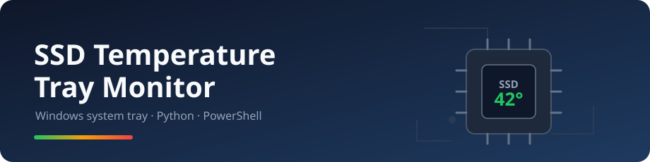
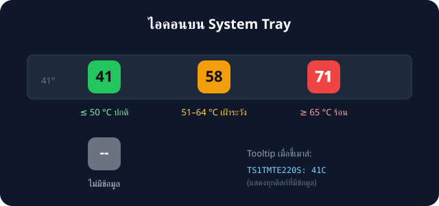
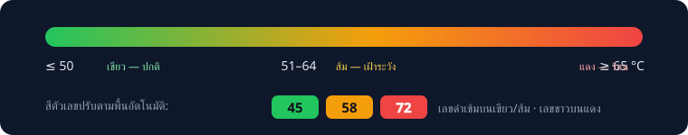

# SSD Temperature Tray Monitor — คู่มือผู้ใช้ (ภาษาไทย)

แอป Python ขนาดเล็กไฟล์เดียว ที่แสดง**อุณหภูมิ SSD** ไว้บน system tray icon
ของ Windows แบบเรียลไทม์ (อัปเดตทุก 1 วินาที) พร้อมสีเตือนเมื่อดิสก์ร้อนเกินไป

## คุณสมบัติ

- 🔢 ไอคอน tray แสดงอุณหภูมิ (°C) ของ SSD ที่**ร้อนที่สุด** อัปเดตทุก 1 วินาที
- 🎨 สีเตือน: **เขียว** ≤ 50 °C · **ส้ม** 51–64 °C · **แดง** ≥ 65 °C

  

- 💬 Tooltip เมื่อชี้เมาส์แสดงอุณหภูมิของทุกดิสก์
- 💺 **SSD หลายตัวได้หลายไอคอน** — ดิสก์เพิ่มเติม (ตัวที่ 2 เป็นต้นไป)
  มี tray icon ของตัวเอง อัตโนมัติเมื่อเสียบ/ถอด
- 🖱️ คลิกขวา: *Show details*, *Show temperature graph* (ย้อนหลัง 30 นาที),
  *Show all disks (debug)*, *Settings...*, *Check for updates...*, *About*,
  *Refresh now*, *Record history*, *Exit*
- 🔔 **แจ้งเตือนอุณหภูมิเกิน** — ≥ 65 °C ติดกัน 30 วินาที เตือนซ้ำทุก 5 นาที
- 🚦 เปิดซ้ำไม่ได้ — โปรแกรมรันได้ครั้งละ 1 อินสแตนซ์เท่านั้น
  (อินสแตนซ์ซ้ำขึ้นข้อความแล้วออก · มีตัวติดตั้ง 64-bit ลง Program Files)
- ⚙️ **หน้า Settings** — ปรับ polling / การเตือน / history เก็บลง config.json
- 🔐 **ตรวจ checksum ก่อนอัปเดต** — updater ตรวจ SHA-256 ของไฟล์ก่อนติดตั้งทุกครั้ง
- ℹ️ **หน้า About** — เวอร์ชัน ลิงก์ releases และปุ่มเช็คอัปเดต
- 🔄 **Auto-update** — เช็ค GitHub Releases อัตโนมัติ แจ้งเตือนและติดตั้งจากเมนู
- 🛡️ ขอสิทธิ์ Administrator อัตโนมัติผ่าน UAC (จำเป็นสำหรับอ่าน SMART)
- 📦 มี **exe สำเร็จรูป** (`dist\ssd_temp_monitor.exe`) — ไม่ต้องติดตั้ง Python
- 🔌 **แสดงเฉพาะ SSD ภายในเครื่อง** — ไม่นับ USB card reader / external enclosure
  (ดูเหตุผลใน [RESEARCH.md](RESEARCH.md))

## ความต้องการของระบบ

| รายการ | รายละเอียด |
|---|---|
| OS | Windows 10 / 11 |
| Python | 3.8 ขึ้นไป |
| Libraries | `pip install pystray Pillow` |
| สิทธิ์ | Administrator (แอปขอเองผ่าน UAC) |

## วิธีใช้งาน

วิธีที่ง่ายที่สุด: ดับเบิลคลิก `dist\ssd_temp_monitor.exe`
(หรือถ้ามี Python: ดับเบิลคลิก `start_ssd_temp_monitor.bat` หรือสั่ง `pyw ssd_temp_tray.py`)

รอบแรกจะมีหน้าต่าง UAC ขึ้นมาให้กด **Yes** จากนั้นไอคอนอุณหภูมิจะปรากฏ
ที่มุมขวาล่างของ taskbar

### ตั้งให้รันตอนเปิดเครื่อง (ไม่บังคับ)

กด `Win+R` พิมพ์ `shell:startup` แล้ววาง shortcut ของ
`start_ssd_temp_monitor.bat` ไว้ในโฟลเดอร์นั้น
(Windows จะถาม UAC ทุกครั้งตอนล็อกอิน เพราะการอ่านอุณหภูมิ SMART
ต้องใช้สิทธิ์ admin)

## บันทึกประวัติและดูกราฟ (ไม่บังคับ)

เปิด **Record history** ในเมนูคลิกขวา โปรแกรมจะบันทึกอุณหภูมิลง
`%TEMP%\ssd_temp_history.csv` (เก็บ 30 นาทีล่าสุด, เขียนไฟล์ทุก 60 วินาที)
แล้วเปิด **Show temperature graph** เพื่อดูกราฟพร้อมค่า min/max/avg
กราฟจะ**อัปเดตสดทุก 1 วินาที** — เปิดเมนูซ้ำจะโฟกัสหน้าต่างเดิม
ถ้าต้องการให้บันทึกตลอด ตั้ง environment variable `SSD_TEMP_RECORD_HISTORY=1`
ก่อนเปิดโปรแกรม

## การแจ้งเตือนอุณหภูมิเกิน

เมื่อดิสก์ร้อน ≥ 65 °C **ติดต่อกัน 30 วินาที** โปรแกรมจะส่ง notification
ของ Windows แจ้งเตือน (กันตัวเลขกระโดดหลอก) เตือนซ้ำไม่ถี่กว่าทุก 5 นาที
ถ้าอุณหภูมิลดลงต่ำกว่าเกณฑ์แล้วกลับมาร้อนใหม่ จะเริ่มนับ 30 วินาทีใหม่

## ภาษาและการอ่านง่ายของไอคอน

หน้า Settings เลือก **ภาษา / Language** ได้เป็น `en` (อังกฤษ) หรือ `th` (ไทย) —
เมนู tray, หน้าต่างทุกใบ, หน้า Settings และการแจ้งเตือนทั้งหมดเปลี่ยนตามทันที
(เมนู rebuild ให้เอง ไม่ต้องรีสตาร์ท) ค่านี้บันทึกใน config.json เหมือนการตั้งค่าอื่น

ไอคอน tray ออกแบบให้อ่านง่าย: เม็ดสีขยายเต็มพื้นที่ไอคอน ตัวเลขใช้สีตัดกับพื้น
อัตโนมัติ (ดำเข้มบนเขียว/ส้ม ขาวบนแดง) พร้อมเส้น stroke บาง ๆ กันเบลอ —
ถ้าใช้ taskbar สีอ่อน แนะนำเปิด **high-contrast** เพิ่ม

## หน้า Settings

เมนูคลิกขวา → **Settings...** ปรับได้ทั้ง polling interval (1–60 วินาที),
alert threshold (40–90 °C), sustain/cooldown, ความยาว history (5–240 นาที),
record-on-start, **ขนาดไอคอน (16–128 px)**, **โหมด high-contrast**
(เม็ดดำขอบขาว — อ่านง่ายบน taskbar สีอ่อน), **ช่องทางอัปเดต** (stable /
pre-release), **ช่วงเวลาเช็คอัปเดต (5–1440 นาที)** และ multi-disk icons —
บันทึกลง `%APPDATA%\SSDTempMonitor\config.json` และ**มีผลทันทีทุกค่า**
(รวมถึงขนาดไอคอนและ polling interval — ไม่ต้องรีสตาร์ท)
ลบไฟล์ config เพื่อรีเซ็ตค่าเริ่มต้น

## Event log

แอปบันทึกเหตุการณ์สำคัญลง `%APPDATA%\SSDTempMonitor\ssd_temp_monitor.log`
(หมุนเวียนอัตโนมัติ 512 kB × 3 ไฟล์): เริ่ม/ปิดโปรแกรม, การแจ้งเตือนอุณหภูมิเกิน,
การตรวจพบ/ติดตั้งอัปเดต และเวลาที่ดิสก์หาย/เพิ่ม — ใช้ไฟล์นี้ยืนยันอาการเวลารายงานบั๊ก

## ทำไมไอคอนถึงขึ้น "--"?

ไอคอน `--` (สีเทา) หมายความว่าไม่พบข้อมูลอุณหภูมิ สาเหตุที่พบบ่อย:

1. แอปไม่ได้รันในสิทธิ์ Administrator
2. ไม่มี SSD ภายในเครื่อง (เช่น มีแต่ HDD)
3. SSD รุ่นนั้นไม่รายงาน temperature counter ผ่าน
   `Get-StorageReliabilityCounter`

หมายเหตุ: **USB card reader จะไม่ถูกนับ** — นี่คือการตั้งใจออกแบบ
เพราะ bridge chip ของอุปกรณ์ USB มักรายงานค่าอุณหภูมิที่ผิดพลาด
อ่านรายละเอียดได้ใน [RESEARCH.md](RESEARCH.md)

## เอกสารอื่น ๆ

| เอกสาร | เนื้อหา |
|---|---|
| [RESEARCH.md](RESEARCH.md) | วิเคราะห์ปัญหา USB reader + วิธีแก้ |
| [CHANGELOG.md](CHANGELOG.md) | ประวัติการเปลี่ยนแปลง |
| [USER_GUIDE_EN.md](USER_GUIDE_EN.md) | คู่มือภาษาอังกฤษ (มีฉบับ [HTML](USER_GUIDE_EN.html) ด้วย) |
| [../README.md](../README.md) | คู่มือภาษาอังกฤษ (root) |
