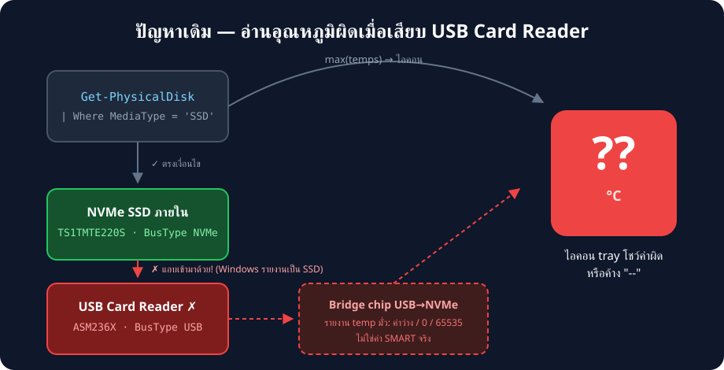
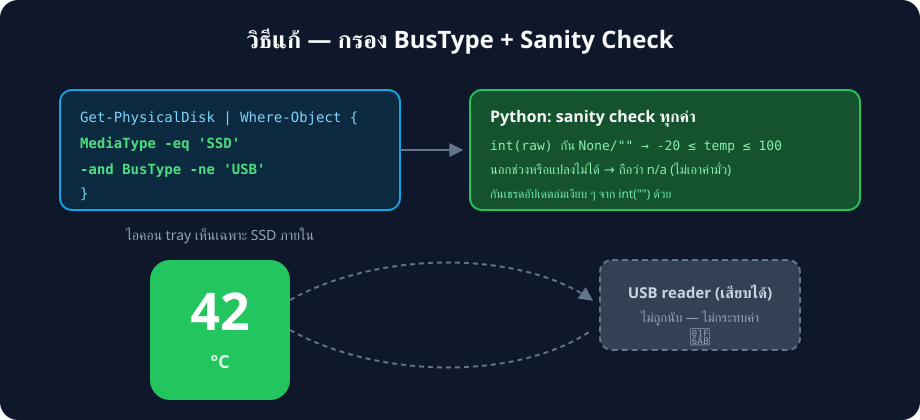

# Research — ปัญหาอ่านอุณหภูมิผิดพลาดเมื่อเสียบ USB Card Reader


## อาการ

เมื่อเสียบ **USB card reader / external NVMe enclosure** เข้ากับเครื่อง
โปรแกรมอ่านอุณหภูมิ SSD ผิดพลาด อาจแสดงค่าที่ผิดจริง, ขึ้นตัวเลขแปลก ๆ
หรือไอคอนค้างเป็น `--` ทั้งที่ SSD ภายในปกติ

## สาเหตุที่พบจากการตรวจสอบบนเครื่องจริง

ผลจาก `Get-PhysicalDisk` บนเครื่องที่เกิดปัญหา:

| Model | MediaType | BusType | เป็นอะไร |
|---|---|---|---|
| TS1TMTE220S | SSD | NVMe | SSD ภายใน (ตัวจริง) |
| ASM236X NVME ASMT | **SSD** | **USB** | Card reader / enclosure |

จุดสำคัญ: **Windows รายงาน USB enclosure หลายรุ่นเป็น `MediaType = 'SSD'`**
เพราะ bridge chip (เช่น ASMedia ASM236X) โฆษณาตัวเองกับระบบแบบนั้น
ขณะที่โค้ดเดิมกรองแค่:

```powershell
Get-PhysicalDisk | Where-Object MediaType -eq 'SSD'
```

จึงจับอุปกรณ์ USB เข้ามาในการคำนวณด้วย แล้วเกิดปัญหา 2 ชั้น:



### ปัญหาชั้นที่ 1 — ค่าอุณหภูมิจาก bridge chip ไม่น่าเชื่อถือ

`Get-StorageReliabilityCounter` กับดิสก์ USB มักได้ค่า `Temperature`
ที่เป็น **ค่าว่าง, 0, หรือ 65535** — bridge chip ส่วนใหญ่ไม่ได้ส่งต่อ
SMART attribute อุณหภูมิจริง หรือส่งในรูปแบบที่ Windows แปลไม่ถูก
โปรแกรมจึงเอาค่ามั่วนี้ไปแสดง (หรือเอาไป max() รวมกับ SSD จริง ทำให้
ไอคอนโชว์ตัวเลขที่ผิดทั้งที่ SSD จริงปกติ)

### ปัญหาชั้นที่ 2 (บั๊กแฝง) — `int()` กับค่าว่างทำเธรดล่ม

โค้ดเดิม:

```python
temp = int(temp) if temp is not None else None
```

เมื่อ PowerShell ส่ง `temp` มาเป็น**สตริงว่าง** (`""` — เกิดบ่อยกับ
อุปกรณ์ USB) เงื่อนไข `is not None` ผ่าน แล้ว `int("")` ยก
`ValueError` — exception นี้เกิดในเธรด poll พื้นหลัง ทำให้**เธรดอัปเดต
ตายเงียบ ๆ** ไอคอนค้างค่าเดิมตลอดไป แม้จะกด *Refresh now* ก็ตาม
(การกด refresh สร้างเธรดใหม่ได้ แต่จะล่มซ้ำเพราะเจอค่าว่างเหมือนเดิม)

## วิธีแก้



### 1. กรองด้วย BusType ในฝั่ง PowerShell

```powershell
Get-PhysicalDisk | Where-Object {
    $_.MediaType -eq 'SSD' -and $_.BusType -ne 'USB'
}
```

ดิสก์ที่ต่อผ่าน USB ทุกชนิด (card reader, enclosure, adapter) ถูกตัดออก
ตั้งแต่ต้นทาง ไม่ว่า bridge chip จะโฆษณา MediaType ว่าอะไร

### 2. Sanity check ในฝั่ง Python

```python
try:
    temp = int(raw) if raw not in (None, "") else None
except (TypeError, ValueError):
    temp = None
if temp is not None and not -20 <= temp <= 100:
    temp = None   # ค่านอกช่วง = ขยะจาก bridge chip
```

- กัน `None` **และ** สตริงว่างก่อนแปลง → เธรดไม่ล่ม
- อุณหภูมิ SMART ของ SSD จริงอยู่ในช่วง -20..100 °C เสมอ
  (threshold วิกฤตของ SSD ส่วนใหญ่ ~70–85 °C) ค่านอกช่วงเช่น
  0 °C ในห้องแอร์ธรรมดา หรือ 65535 ถือเป็นขยะ → แสดง n/a แทน

### 3. ทำไมไม่ใช้วิธีอื่น

| ทางเลือก | ทำไมไม่เลือก |
|---|---|
| กรองด้วย `DeviceId` ตายตัว | หมายเลขดิสก์เปลี่ยนตามการเสียบ/ถอดอุปกรณ์ |
| Blacklist ชื่อรุ่น (เช่น "ASM236X") | มี bridge chip อีกหลายสิบรุ่น ไล่ตามไม่ไหว |
| อ่าน SMART ตรง ๆ ด้วย WinAPI | ต้องเขียน driver ioctl เอง ซับซ้อนเกินจำเป็น |
| Smartctl (smartmontools) | ต้องติดตั้งโปรแกรมเพิ่ม ขัดกับคอนเซ็ปต์ไฟล์เดียว |

การกรอง `BusType -ne 'USB'` เป็นวิธีเดียวที่ครอบคลุมทุกอุปกรณ์ USB
โดยไม่ต้องรู้จักรุ่น และยังอนุญาตให้ SSD ต่อผ่านทางอื่น (SATA, NVMe)
ถูกนับตามปกติ

## การค้นครั้งที่ 2 — USB bridge ทำให้การอ่านค้าง 42 วินาที

การวัดเวลาแบบ elevated (รันต่อดิสก์) ให้ผลที่น่าตกใจ:

| ดิสก์ | เวลาที่ `Get-StorageReliabilityCounter` ใช้ | temp ที่ได้ |
|---|---|---|
| TS1TMTE220S [NVMe] | 0.1 s | **36 °C** (ถูกต้อง) |
| ASM236X [USB] | **42.1 s** (แทบค้าง) | 0 (ค่ามั่ว) |

กล่าวคือ bridge chip USB ไม่ได้แค่รายงานค่าผิด แต่**บล็อกการอ่าน counter
นานถึง ~42 วินาที** — query เดิมที่อ่าน counter ของทุกดิสก์ (รวม USB)
จึงชน timeout 30 s และคืนค่าว่างทั้งหมด (และยังทำให้เธรด poll ค้าง
เป็นรอบ ๆ ด้วย)

### วิธีแก้รอบสอง — แยก 2 query, กรองก่อนอ่าน

1. **`PS_TEMPS`** (ใช้กับ tray): `Where-Object { MediaType -eq 'SSD' -and
   BusType -ne 'USB' }` **ก่อน** pipe เข้า `Get-StorageReliabilityCounter`
   → ดิสก์ USB ไม่ถูกแตะเลย query ใช้เวลา ~1 s
2. **`PS_LIST`** (ใช้กับหน้า debug): ดึงรายชื่อดิสก์ทั้งหมดแบบไม่อ่าน counter
   เลย (~1 s เสมอ) แล้วค่อย merge temp จาก `PS_TEMPS` ตามชื่อรุ่น —
   ดิสก์ USB จะแสดง n/a แต่หน้าต่างเปิดได้ทันที

บทเรียน: **ตำแหน่งของ filter สำคัญเท่ากับตัว filter เอง** ใน pipeline ที่มี
command ที่อาจค้าง — ต้องกรองตัวที่มีปัญหาออกก่อนถึงขั้นที่แพงที่สุด

## ข้อจำกัดของวิธีแก้

- คนที่ใช้ **external NVMe enclosure ที่อ่าน temp ได้จริง** (เช่น บางรุ่น
  ผ่านพอร์ต Thunderbolt ที่รายงาน BusType เป็นอย่างอื่น) จะไม่เห็น
  อุณหภูมิดิสก์ภายนอก — แลกกับความถูกต้องของดิสก์ภายใน
- ถ้าอนาคต Windows รายงาน bus type ผิดในทางกลับกัน (SSD ภายในโดน
  ติดป้าย USB) จะต้องเพิ่ม whitelist — ยังไม่พบกรณีนี้ในทางปฏิบัติ

## วิธีทดสอบด้วยตัวเอง

```powershell
# ดูว่าเครื่องเรามีดิสก์อะไร BusType อะไรบ้าง
Get-PhysicalDisk | Select-Object Model, MediaType, BusType
```

เสียบ/ถอด USB reader แล้วรันซ้ำ จะเห็นว่าดิสก์ USB มี `BusType = USB`
เสมอ — ซึ่งจะถูกกรองออกโดย logic ใหม่ใน `read_temps()`
